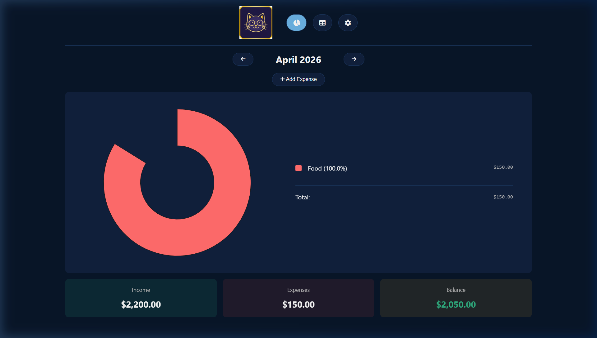
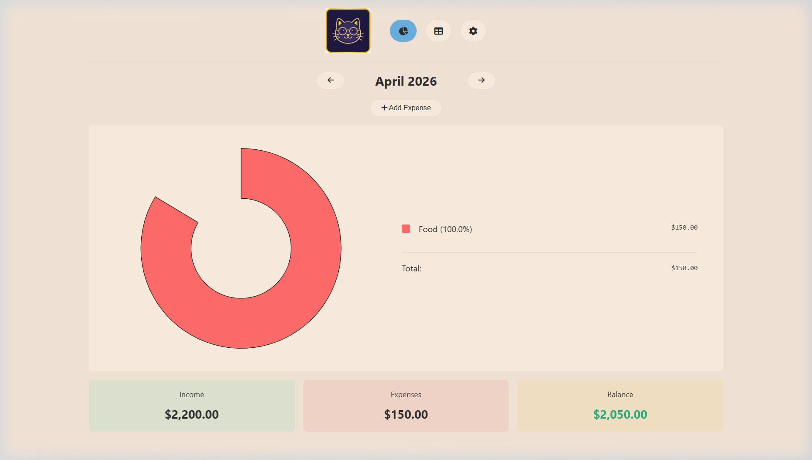
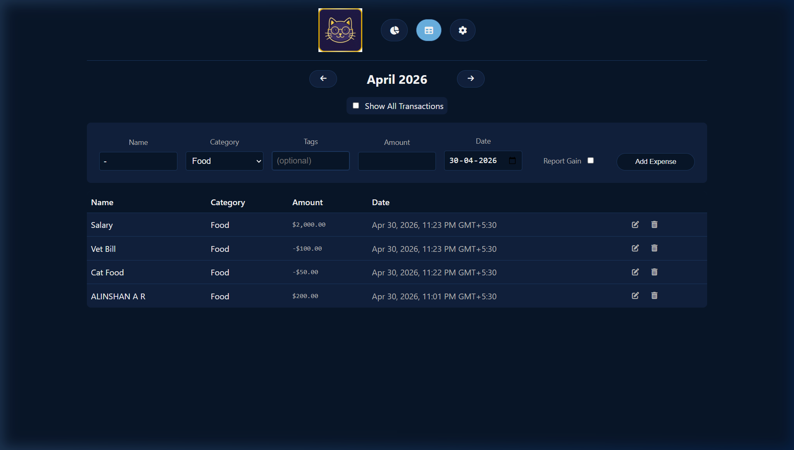
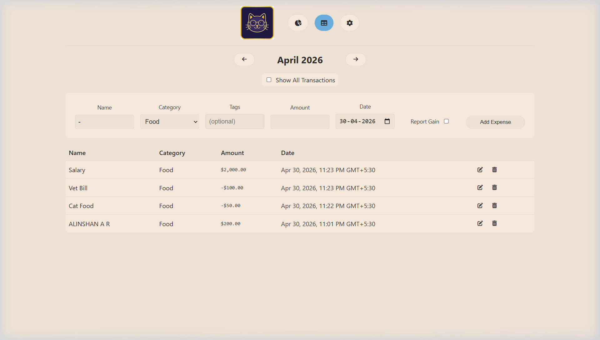
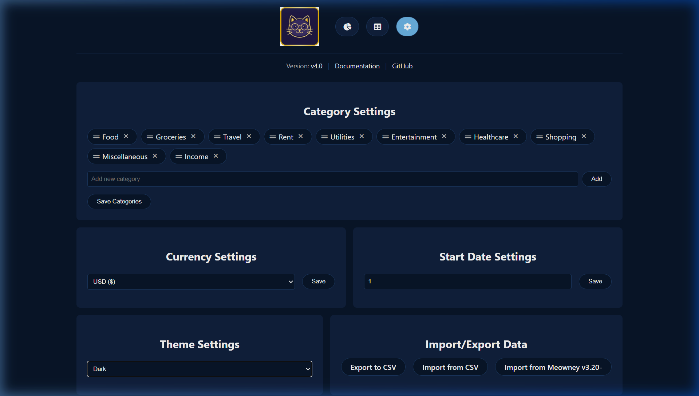
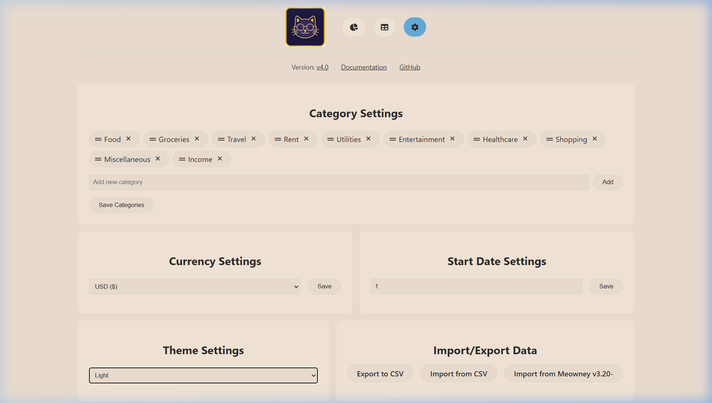

<p align="center">
  
</p>

<h1 align="center">Meowney</h1>

<p align="center">
  <strong>The Purr-fectly Simple Expense Tracker for Your Home Lab.</strong>
</p>

---

## 🐱 What is Meowney?

**Meowney** is a minimalist, self-hosted expense tracking system designed for speed and simplicity. While other tools focus on complex budgeting and multi-account management, Meowney stays focused on one thing: **showing you where your money goes every month with zero friction.**

Built with a "dead simple" philosophy, it provides a beautiful, cat-themed interface that gives you an instant snapshot of your financial cashflow and category breakdowns.

---

## ✨ Key Features

- 🚀 **Blazing Fast Entries** – Add expenses or income in seconds. Only date, amount, and category are required.
- 📊 **Visual Dashboard** – Beautiful interactive pie charts and cashflow indicators.
- 🔄 **Recurring Transactions** – Automate your fixed costs and steady income.
- 🎨 **Dynamic Themes** – Gorgeous Light and Dark modes that respect your system settings.
- 📱 **PWA Ready** – Install it as a native app on your iOS or Android device.
- 🔒 **Privacy First** – 100% self-hosted. No trackers, no telemetry, no cloud dependencies.
- 📂 **Flexible Backends** – Choose between lightweight JSON storage or a robust Postgres database.
- 📥 **Easy Migration** – Import and export your data via CSV effortlessly.

---

## 🛠️ Tech Stack

Meowney is built using a modern, efficient stack designed for easy self-hosting:

- **Backend:** [Go](https://go.dev/) (High-performance, single binary)
- **Frontend:** Vanilla JS, HTML5, CSS3 (No heavy frameworks)
- **Visualization:** [Chart.js](https://www.chartjs.org/)
- **Deployment:** Docker & Kubernetes support

## 🚀 Easy Installation

Meowney is designed to be simple to set up, even if you aren't a developer.

### 🐾 For Beginners (Using Docker)
The easiest way to run Meowney is using [Docker Desktop](https://www.docker.com/products/docker-desktop/).

1. **Install Docker Desktop** for your computer (Windows, Mac, or Linux).
2. **Open your Terminal** (Command Prompt or PowerShell on Windows).
3. **Run this command** to start Meowney:
   ```bash
   docker run -d -p 8080:8080 --name meowney -v meowney_data:/app/data alinshan/meowney:main
   ```
4. **Open your browser** and go to: `http://localhost:8080`

### 🏗️ Advanced Setup (Docker Compose)
If you prefer using Docker Compose, create a `docker-compose.yml` file with this content:

```yaml
services:
  meowney:
    image: alinshan/meowney:main
    container_name: meowney
    restart: unless-stopped
    ports:
      - "8080:8080"
    volumes:
      - ./data:/app/data
```
Then run `docker-compose up -d`.

### 💻 Manual Run (For Go Users)
If you have Go installed, you can run it directly:
1. Clone the repo: `git clone https://github.com/Alinshan/Meowney.git`
2. Run the app: `go run ./cmd/meowney`

---

## 📸 Screenshots

| Dashboard (Dark Mode) | Dashboard (Light Mode) |
| :---: | :---: |
|  |  |

| Table View (Dark Mode) | Table View (Light Mode) |
| :---: | :---: |
|  |  |

| Settings (Dark Mode) | Settings (Light Mode) |
| :---: | :---: |
|  |  |

---

## Configuration

Meowney is designed to be configured directly through the UI, but it also supports environment variables for advanced setups:

| Variable | Description | Default |
| --- | --- | --- |
| `PORT` | The port the server listens on | `8080` |
| `STORAGE_TYPE` | Data backend (`json` or `postgres`) | `json` |
| `STORAGE_URL` | Postgres connection string | `""` |
| `STORAGE_USER` | Postgres username | `""` |
| `STORAGE_PASS` | Postgres password | `""` |

---

## License

Distributed under the MIT License. See `LICENSE` for more information.

## Author

**Alinshan** - [GitHub](https://github.com/Alinshan)

---

